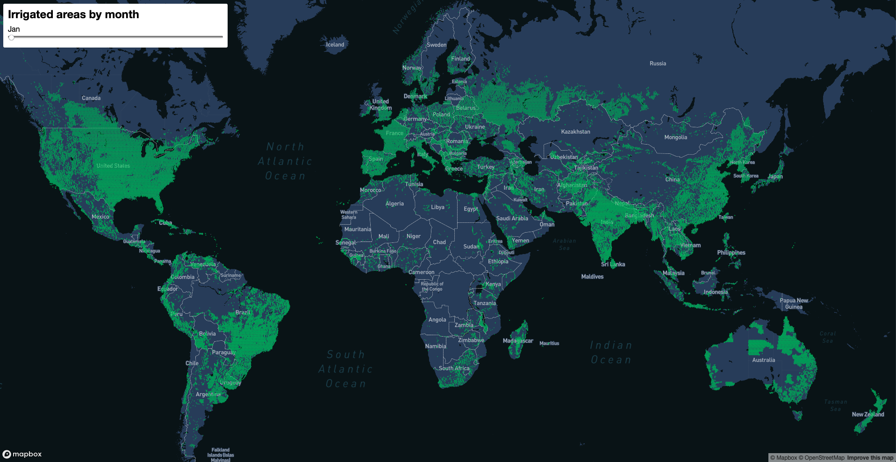

# IrrigationAI

http://people.ischool.berkeley.edu/~kaiqi/IrrigationAI/map.html

## Introduction
This repository contains a Dockerfile which allows for the download of MODIS data between the specific time range, downsamples the tiff image for pre-trainer model inference and outputs a predicted image containing irrigation/no-irrigation classes.

## Data

## Pipeline

## Model

## Output

